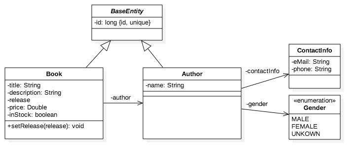

ODataV4 - JavaEE - Example - Apache Olingo
===========================================

This example application is inspired by the `Basic Tutorial: Create an OData V4 Service with Olingo` which can be found in the [OData 4.0 Java Library Documentation](https://olingo.apache.org/doc/odata4/index.html).
The implementation of the OData service is based on the [Apache Olingo OData 4.0 Library for Java](https://olingo.apache.org/doc/odata4/download.html).

Afterwards the Web Application is deployed on a Java EE server, the OData service can be invoked from a browser or a http client and will provide the data according to the [OData V4 specification](http://www.odata.org/documentation). The service will display a list of books and a few properties that describe each book.

Visit my blog for more background informations about this project.

[OData V4 – Implementierung eines Services unter Java EE mittels Apache Olingo](https://www.blogging-it.com/odata-v4-implementierung-eines-services-unter-java-ee-mittels-apache-olingo/programmierung/java/javaee.html) (german)


# Infrastructure

- Java 1.8
- Java EE
- Maven
- Apache TomEE
- HTTP Web-Servlet
- Apache Olingo 4.3.0 (2016-09-19)


# Scenario

The OData service in this example will implement the following simple sample model with the `Book` and `Author` entities.




# Custom Entity Annotations

There is a `Annotation Processor` extension available for the Apache Olingo OData **2.0** library implementation. Unfortunately, there is currently no similar extension for the **4.0** library implementation. That is why I decided to create an own annotation processor, which provided support for elementary requirements for this example.


# Persistence Data Provider

At the moment there is no database connection implemented to provide data for the OData service. To keep it simple, the class `InMemoryDataStorage` provides an in-memory data storage.

# Implemented OData Service Requests

- read Service Document
- read Metadata Document
- read all book or author data
- read single book or author data
- read single book or author property value
- read single book or author property value (plain text)
- create new book or author
- update existing book or author data
- delete existing book or author data
- count number of all books or authors data


## Request: Read Service Document

Furthermore, OData specifies the usage of the so-called Service Document. The user can see which entity collections are offered by the OData service.

Request:

```
PATH:   <serviceroot>/
METHOD: GET
```

**Example**

```
http://localhost:8080/odatav4-javaee-example-apache-olingo/api/servlet/v1/odatademo.svc
```

Result:

The expected result is the Service Document which displays informations of the entity container:

```json
{
    "@odata.context": "$metadata",
    "value":
    [
        {
            "name": "AuthorSet",
            "url": "AuthorSet"
        },
        {
            "name": "BookSet",
            "url": "BookSet"
        }
    ]
}
```

## Request: Read Metadata Document

According to the OData specification, an OData service has to declare its structure in the so-called Metadata Document. This document defines the contract, such that the user of the service knows which requests can be executed, the structure of the result and how the service can be navigated.

Request:

```
PATH:   <serviceroot>/$metadata
METHOD: GET
```

**Example**

```
http://localhost:8080/odatav4-javaee-example-apache-olingo/api/servlet/v1/odatademo.svc/$metadata
```

Result:

The expected result is the Metadata Document that displays the Schema, EntityType, EntityContainer and the EntitySet.

```xml
<?xml version='1.0' encoding='UTF-8'?>
<edmx:Edmx Version="4.0" xmlns:edmx="http://docs.oasis-open.org/odata/ns/edmx">
  <edmx:DataServices>
    <Schema xmlns="http://docs.oasis-open.org/odata/ns/edm" Namespace="OData">
      <EnumType Name="Gender" IsFlags="false" UnderlyingType="Edm.Int32">
        <Member Name="MALE" Value="0"/>
        <Member Name="FEMALE" Value="1"/>
        <Member Name="UNKOWN" Value="2"/>
      </EnumType>
      <EntityType Name="Author">
        <Key>
          <PropertyRef Name="id"/>
        </Key>
        <Property Name="name" Type="Edm.String" Nullable="false" DefaultValue="null"/>
        <Property Name="gender" Type="OData.Gender"/>
        <Property Name="contactInfo" Type="OData.ContactInfo"/>
        <Property Name="id" Type="Edm.Int64" Nullable="false" DefaultValue="0"/>
      </EntityType>
      <EntityType Name="Book">
        <Key>
          <PropertyRef Name="id"/>
        </Key>
        <Property Name="title" Type="Edm.String" Nullable="false" DefaultValue="null"/>
        <Property Name="description" Type="Edm.String" DefaultValue="null" MaxLength="2000"/>
        <Property Name="releaseDate" Type="Edm.Date" DefaultValue="null"/>
        <Property Name="price" Type="Edm.Double" DefaultValue="null"/>
        <Property Name="inStock" Type="Edm.Boolean" DefaultValue="false"/>
        <Property Name="id" Type="Edm.Int64" Nullable="false" DefaultValue="0"/>
        <NavigationProperty Name="author" Type="OData.Author"/>
      </EntityType>
      <ComplexType Name="ContactInfo">
        <Property Name="eMail" Type="Edm.String" Nullable="false" DefaultValue="null"/>
        <Property Name="phone" Type="Edm.String" DefaultValue="null"/>
      </ComplexType>
      <EntityContainer Name="Container">
        <EntitySet Name="AuthorSet" EntityType="OData.Author"/>
        <EntitySet Name="BookSet" EntityType="OData.Book">
          <NavigationPropertyBinding Path="author" Target="AuthorSet"/>
        </EntitySet>
      </EntityContainer>
    </Schema>
  </edmx:DataServices>
</edmx:Edmx>
```

## Request: Read Book Or Author Entity Collection

This request will display a list of books or authors and some properties that describe each entity.

Add the optional `format` parameter to the request url, which contains information about the content type that is requested. This means that the user has the choice to receive the data either in XML or in JSON (default).
If the content type is `application/json;odata.metadata=minimal`, then the payload is formatted in JSON.
The content format can as well be specified via the request header `Accept: application/json;odata.metadata=minimal`.

Internally the `DataCollectionProcessor#readEntityCollection` implementation of the OData service will be invoked.

Request:

```
PATH:   <serviceroot>/BookSet    or    <serviceroot>/AuthorSet
METHOD: GET
Header (optional): Accept: application/json;odata.metadata=minimal
```

**Example**

```
http://localhost:8080/odatav4-javaee-example-apache-olingo/api/servlet/v1/odatademo.svc/BookSet

or

http://localhost:8080/odatav4-javaee-example-apache-olingo/api/servlet/v1/odatademo.svc/BookSet?$format=xml

or

http://localhost:8080/odatav4-javaee-example-apache-olingo/api/servlet/v1/odatademo.svc/BookSet?$format=application/json;odata.metadata=minimal
```

Result:

The expected result is the list of book entries:

```json
{
    "@odata.context": "$metadata#BookSet",
    "value":
    [
        {
            "title": "Book Title 1",
            "description": "This is the description of book 1",
            "releaseDate": "2011-07-21",
            "price": 9.95,
            "inStock": true,
            "id": 1
        },
        {
            "title": "Book Title 2",
            "description": "This is the description of book 2",
            "releaseDate": "2015-08-06",
            "price": 5.99,
            "inStock": true,
            "id": 2
        },
        {
            "title": "Book Title 3",
            "description": "This is the description of book 3",
            "releaseDate": "2013-05-12",
            "price": 14.5,
            "inStock": false,
            "id": 3
        }
    ]
}
```

### System Query Option $count

The `$count` query option allows to request a count of the matching resources. The number will be included with the resources in the response. The $count system query option with a value of `true` specifies that the total count of items within a collection matching the request be returned along with the result.

OData V4 Spec Hint: The $count system query option ignores any $top, $skip, or $expand query options, and returns the total count of results across all pages including only those results matching any specified $filter and $search.

**Example**

```
http://localhost:8080/odatav4-javaee-example-apache-olingo/api/servlet/v1/odatademo.svc/BookSet?$count=true
```


```json
{
    "@odata.context": "$metadata#BookSet",
    "@odata.count": 3,
    "value":
    [
        {
         ...
```


## Request: Read Single Book Or Author Entity

This request will display the details of a single book or author entity, which has the corresponding ID.

Internally the `DataEntityProcessor#readEntity` implementation of the OData service will be invoked.

Request:

```
PATH:   <serviceroot>/BookSet(ID_OF_THE_BOOK)    or    <serviceroot>/AuthorSet(id=ID_OF_THE_BOOK)
METHOD: GET
Header (optional): Accept: application/json;odata.metadata=minimal
```

**Example**

```
http://localhost:8080/odatav4-javaee-example-apache-olingo/api/servlet/v1/odatademo.svc/BookSet(1)
```

Result:

The expected result is a response with the details of a single book with the id 1.


```json
{
    "@odata.context": "$metadata#BookSet/$entity",
    "title": "Book Title 1",
    "description": "This is the description of book 1",
    "releaseDate": "2011-07-21",
    "price": 9.95,
    "inStock": true,
    "id": 1
}
```

## Request: Read Single Book or Author Property

If you don't want to receive the full payload of the entity, you can use this request to receive only the value of the property of the OData model you needed.

Internally the `DataPrimitiveProcessor#readPrimitive` or `DataPrimitiveValueProcessor#readPrimitive` implementation of the OData service will be invoked.

Request:

```
PATH:   <serviceroot>/BookSet(ID_OF_THE_BOOK)/PROPERTY_NAME
METHOD: GET
Header (optional): Accept: application/json;odata.metadata=minimal
```

**Example**

```
http://localhost:8080/odatav4-javaee-example-apache-olingo/api/servlet/v1/odatademo.svc/BookSet(1)/title
```

Result:

The expected result is a response with the title value of the book with the id 1.

```json
{
    "@odata.context": "$metadata#BookSet/title",
    "value": "Book Title 1"
}
```

### Plain Text Value

If you use the `DataPrimitiveValueProcessor#readPrimitiveValue` implementation, it is also possible to request only the pure plain text value of a property.

Request:

```
PATH:   <serviceroot>/BookSet(ID_OF_THE_BOOK)/PROPERTY_NAME/$value
METHOD: GET
Header (optional): Accept: application/json;odata.metadata=minimal
```

**Example**

```
http://localhost:8080/odatav4-javaee-example-apache-olingo/api/servlet/v1/odatademo.svc/BookSet(1)/title/$value
```

Result:

The expected result is a response with only the pure plain text value of the title property.

```text
Book Title 1
```

## Request: Create New Book Or Author

With this request we can create a new book (with author data) or a new author and add it to the available list.
The Olingo library takes this request, serializes the request body and invokes the corresponding method of our processor class. 

Internally the `DataEntityProcessor#createEntity` implementation of the OData service will be invoked.

Request:

```
PATH:   <serviceroot>/BookSet    or    <serviceroot>/AuthorSet
METHOD: POST
Header: Content-Type: application/json;odata.metadata=minimal
Body:   JSON data
```

**Example - New Book**

```
http://localhost:8080/odatav4-javaee-example-apache-olingo/api/servlet/v1/odatademo.svc/BookSet
```

Request Body:

```json
{
    "title": "Book Title New",
    "description": "This is the description of the new book",
    "releaseDate": "2017-04-21",
    "author": {
        "name": "Author New",
        "gender": "FEMALE"
    },
    "price": 11.95,
    "inStock": true
}
```

Result:

The result is a response with the details of the new book with the new assigned id.

```json
{
    "@odata.context": "$metadata#BookSet",
    "title": "Book Title New",
    "description": "This is the description of the new book",
    "releaseDate": "2017-04-21",
    "price": 11.95,
    "inStock": true,
    "id": 4
}
```


**Example - New Author**

```
http://localhost:8080/odatav4-javaee-example-apache-olingo/api/servlet/v1/odatademo.svc/AuthorSet(1)
```

Request Body:

```json
{
    "name": "Author 5 New",
    "gender": "MALE",
    "contactInfo": {
        "eMail": "author5@test.xyz",
        "phone": "111/111"
    }
}
```

Result:

The result is a response with the details of the new author with the new assigned id.

```json
{
    "@odata.context": "$metadata#AuthorSet",
    "name": "Author 5 New",
    "gender": "MALE",
    "contactInfo":
    {
        "eMail": "author5@test.xyz",
        "phone": "111/111"
    },
    "id": 6
}
```

## Request: Update Existing Book Or Author

With this request we can update the values of an existing book or author. The update of an entity can be realized either with a `PUT` or a `PATCH` request.

**PUT**: The value of the property is updated in the backend. The value of the other properties is set to null (exception: key properties can never be null).

**PATCH**: The value of the property is updated in the backend. The values of the other properties remain untouched.

The difference becomes relevant only in case if the user doesn’t send all the properties in the request body.

Internally the `DataEntityProcessor#updateEntity` implementation of the OData service will be invoked.

Request:

```
PATH:   <serviceroot>/BookSet(ID_OF_THE_BOOK)    or    <serviceroot>/AuthorSet(ID_OF_THE_AUTHOR)
METHOD: PUT or PATCH
Header: Content-Type: application/json;odata.metadata=minimal
Body:   JSON data
```

**Example**

```
http://localhost:8080/odatav4-javaee-example-apache-olingo/api/servlet/v1/odatademo.svc/BookSet(2)
```

Request Body:

```json
{
    "title": "Book Title 2 Updated",
    "description": "This is the description of book 2 Updated"
}
```

Result:

The OData service is not expected to return any response payload (HTTP status code to 204 – no content).


## Request: Delete Existing Book Or Author

With this request we can remove data record of an existing book or author.

Internally the `DataEntityProcessor#deleteEntity` implementation of the OData service will be invoked.

Request:

```
PATH:   <serviceroot>/BookSet(ID_OF_THE_BOOK)    or    <serviceroot>/AuthorSet(ID_OF_THE_AUTHOR)
METHOD: DELETE
```

**Example**

```
http://localhost:8080/odatav4-javaee-example-apache-olingo/api/servlet/v1/odatademo.svc/BookSet(2)
```

Result:

The OData service is not expected to return any response payload (HTTP status code to 204 – no content).


## Request: Count Number Of All Books Or Authors Data

To request only the number of items of a collection of entities or items of a collection-valued property, create a GET request with `/$count` appended to the resource path of the collection. On success, the response body MUST contain the exact count of items.

Internally the `DataCollectionProcessor#countEntityCollection` implementation of the OData service will be invoked.


Request:

```
PATH:   <serviceroot>/BookSet/$count    or    <serviceroot>/AuthorSet/$count
METHOD: GET
```

**Example**

```
http://localhost:8080/odatav4-javaee-example-apache-olingo/api/servlet/v1/odatademo.svc/BookSet/$count
```

Result:

The result is a response with the count number of all books.

----------------------------------
Markus Eschenbach
[www.blogging-it.com](http://www.blogging-it.com)

